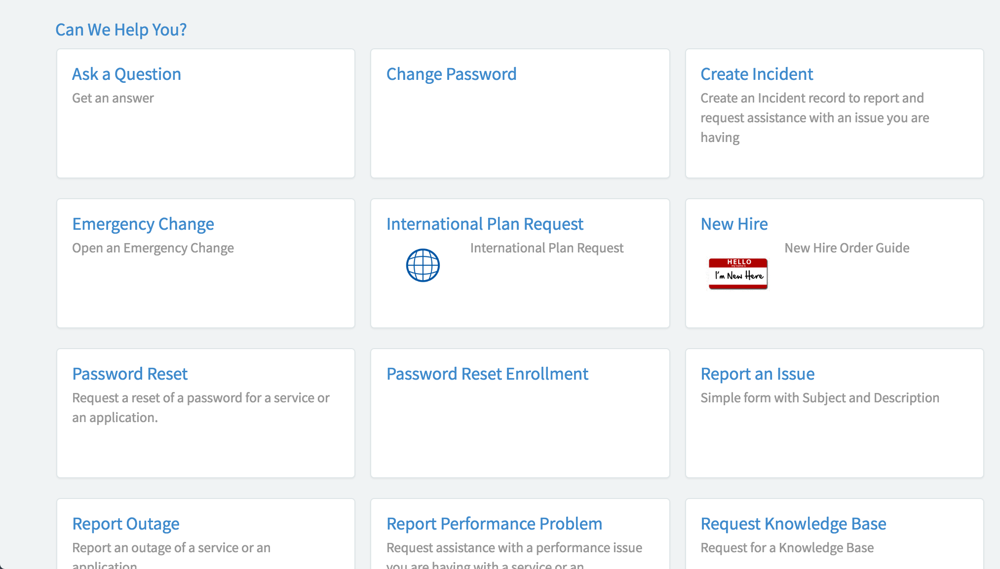

##  Catalog Content

## Description

The Catalog Content widget is part of the Service Catalog and includes a tiled list of all the content items available in the catalog.

The items that appear on the page are grouped by category alphabetically. Catalog items and categories are defined in the Service Catalog application in the platform. For more information on creating catalog items to appear in the catalog, see [Create a catalog item](https://docs.servicenow.com/search?q=%22create+a+catalog+item%22).

Catalog can be specified on the URL or else the widget picks up the catalog specified on the portal record. 
You can view an example of this widget in action from your instance - `https://{instance}.service-now.com/sp?id=sc_view`

## Screenshots

---
## Configuration

Widget Option Schema parameters:
> None
---
## ServiceNow® Documentation
[Product Documentation](https://docs.servicenow.com/search?q=Catalog+Content+widget) 

---
## Enhance or Expand Features and Functionality

OOB Widgets are `READ ONLY` so you can benefit from future updates. Edit and extend a widget's functionality; you need to clone it first in order to take advantage of existing code.

View production documentation ['Clone a Widget'](https://docs.servicenow.com/search?q=Clone+a+Widget) to learn more.

---
## Platform Dependencies

> Service Catalog
