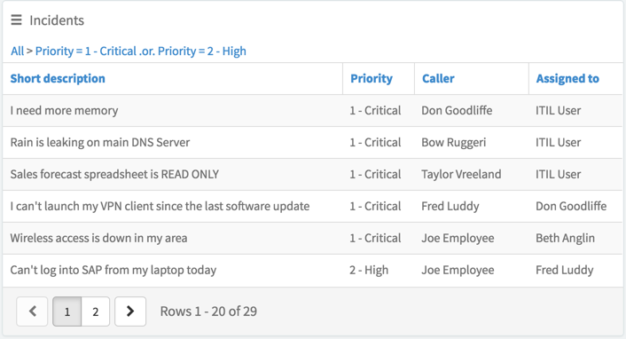

##  Data Table from Instance Definition

## Description

Data table from instance definition displays a table that you define using the widget instance options.

After you add the data table from instance definition widget to a page, use the instance options to configure the appearance of the table.

## Screenshots

---
## Configuration

Widget Option Schema parameters:
> None
---
## ServiceNow® Documentation
[Product Documentation](https://docs.servicenow.com/search?q=Data+table+from+instance+definition) 

---
## Enhance or Expand Features and Functionality

OOB Widgets are `READ ONLY` so you can benefit from future updates. Edit and extend a widget's functionality; you need to clone it first in order to take advantage of existing code.

View production documentation ['Clone a Widget'](https://docs.servicenow.com/search?q=Clone+a+Widget) to learn more.
