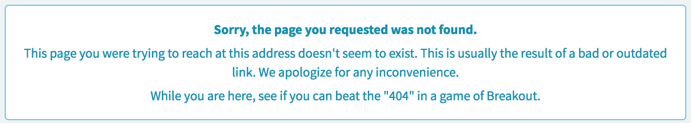

# HTML

## Description

Use the HTML widget to directly inject HMTL, text, lists, or content in general into a page.

Because the HTML widget can contain content of any kind, any example may just appear as regular text. For example, the HTML widget appears as a box of text on the 404 page.

## Screenshots

---
## Configuration

Widget Option Schema parameters:

**HTML** - Use to fill the widget with HTML markup. _Default: <b>hello</b>_

---
## ServiceNow® Documentation
[Product Documentation](https://docs.servicenow.com/bundle/istanbul-servicenow-platform/page/build/service-portal/concept/html-widget.html)

---
## Enhance or Expand Features and Functionality

OOB Widgets are _READ ONLY_ so you can benefit from future updates. Edit and extend a widget's functionality; you need to clone it first in order to take advantage of existing code.

View production documentation ['Clone a Widget'](https://docs.servicenow.com/bundle/istanbul-servicenow-platform/page/build/service-portal/task/t_CloneAndEditAWidget.html) to learn more.

---
## Demo Data

The Widget is supplied with demo data `<i>Hi</i>` for the **HTML** option schema parameter.
