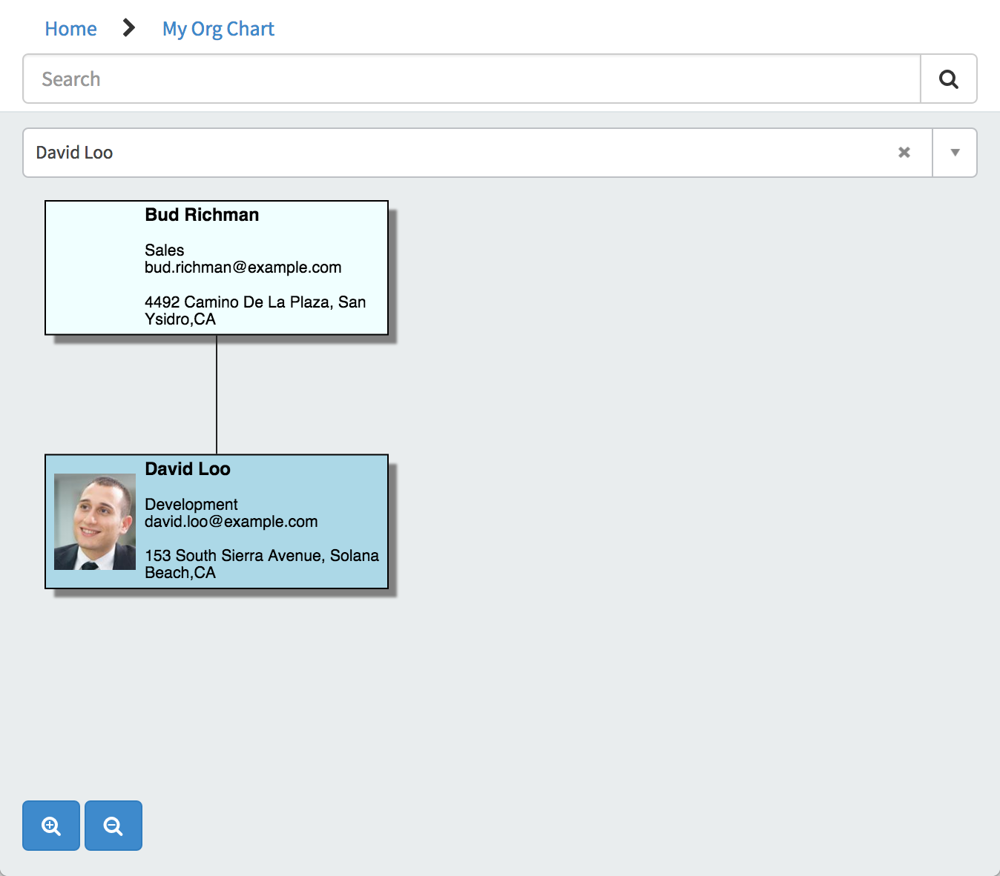

# Organization Chart

## Description

The Organization Chart widget shows employees in a tree structure relative to their manager.

The Organization Chart widget gets data from the Users table [sys_users].

## Screenshots


---
## Configuration

Widget Option Schema parameters:

**Card Fields** JSON object identifing the Users table [sys_users] fields to be shown on the card<br/>
**User Background Color** Color used for the Selected User's card background color.<br/>
**Node Background Color** Color used for the Node cards' background color that do not represent the Selected User.<br/>
**URL** URL to open on click<br/>
**Table Layout** CSS inline style object for the styling of the table.<br/>
**Row Layout** CSS inline style object for the styling of the table rows.<br/>
**Line** CSS inline style object for the color of the line connecting the nodes.<br/>
**Tree Layout** Style object for the configuration of the Organization Chart rendering.<br/>
**Picture Layout** CSS inline style object for the styling of the avatar/picture displayed.<br/>
**Node Layout** CSS inline style object for the styling of the nodes.<br/>
**Page** Page ID used with the URL Option Schema parameter value `id={page}`<br/>

> Note: Color options can be in the form of color words (red,blue,azure,etc) or HEX values (#ff0000, #00ff00, #b4b4b4, etc).

```javascript
// Default Values
	options.table_layout = options.table_layout || {margin: 4, maxSize: '{new go.Size(180, NaN)}'}
	options.row_layout = options.row_layout || {column: 0, stretch: '{go.GraphObject.Horizontal}', alignment: '{go.Spot.Left}'};
	options.node_layout = options.node_layout || {cursor: "pointer", isShadowed: true}
	options.user_background_color = options.user_background_color || 'lightblue';
	options.node_background_color = options.node_background_color || 'azure';
	options.url = options.url || '?id={page}&sys_id={sys_id}';
	options.line = options.line || {stroke: '#222'};
	options.page = options.page || 'user_profile';
	options.card_fields = options.card_fields || {
			name: {row: 0, column: 0, columnSpan: 2, font: 'bold 9pt sans-serif', alignment: '{go.Spot.Top}',  maxSize: '{new go.Size(160, NaN)}'},
			title: {row: 1, column: 0, columnSpan: 2, font: '8pt sans-serif'},
			department: {row: 2, column: 0, columnSpan: 2, font: '8pt sans-serif'},
			email: {row: 3, column: 0, columnSpan: 2, font: '8pt sans-serif'},
			phone: {row: 4, column: 0, columnSpan: 2, font: '8pt sans-serif'},
			location: {row: 5, column: 0, columnSpan: 2, font: '8pt sans-serif'}
	};
	options.tree_layout = options.tree_layout || {
				treeStyle: '{go.TreeLayout.StyleLastParents}',
				angle: 90,
				layerSpacing: 80,
				alternateAngle: 0,
				alternateAlignment: '{go.TreeLayout.AlignmentStart}',
				alternateNodeIndent: 20,
				alternateNodeIndentPastParent: 1,
				alternateNodeSpacing: 20,
				alternateLayerSpacing: 40,
				alternateLayerSpacingParentOverlap: 1,
				alternatePortSpot: '{new go.Spot(0, 0.999, 20, 0)}',
				alternateChildPortSpot: '{go.Spot.Left}'
			};

	options.picture_layout = options.picture_layout || {
		name: 'Picture',
		desiredSize: '{new go.Size(55, 65)}',
		margin: '{new go.Margin(2, 2, 2, 6)}',
		imageStretch: '{go.GraphObject.UniformToFill}'
	};
```
---
## ServiceNow® Documentation
[Product Documentation](https://docs.servicenow.com/bundle/istanbul-servicenow-platform/page/build/service-portal/concept/org-chart-widget.html)

---
## Enhance or Expand Features and Functionality

OOB Widgets are `READ ONLY` so you can benefit from future updates. Edit and extend a widget's functionality; you need to clone it first in order to take advantage of existing code.

View production documentation ['Clone a Widget'](https://docs.servicenow.com/bundle/istanbul-servicenow-platform/page/build/service-portal/task/t_CloneAndEditAWidget.html) to learn more.


---
## Platform Dependencies

### Data Tables
* sys_users

