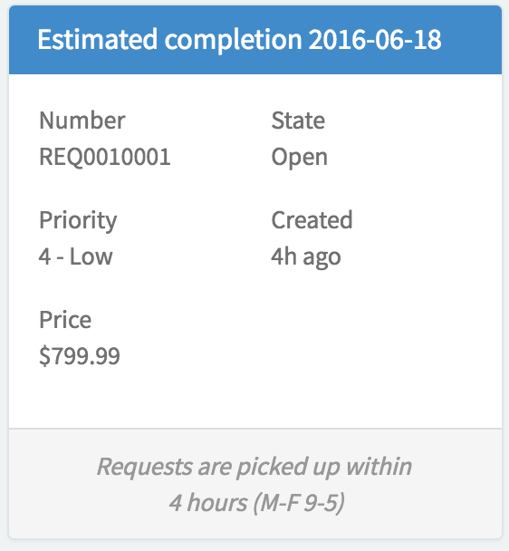

# Request Fields

## Description

The Request Fields widget display information about any request a user has made.

## Screenshots

---
## Configuration

> Fields are defined by the HTML template and the server.

Widget Option Schema parameters:

**Pickup message** Use to change the message that appears in the widget

---
## ServiceNow® Documentation
[Product Documentation](https://docs.servicenow.com/bundle/istanbul-servicenow-platform/page/build/service-portal/concept/request-fields-widget.html)

---
## Enhance or Expand Features and Functionality

OOB Widgets are `READ ONLY` so you can benefit from future updates. Edit and extend a widget's functionality; you need to clone it first in order to take advantage of existing code.

View production documentation ['Clone a Widget'](https://docs.servicenow.com/bundle/istanbul-servicenow-platform/page/build/service-portal/task/t_CloneAndEditAWidget.html) to learn more.