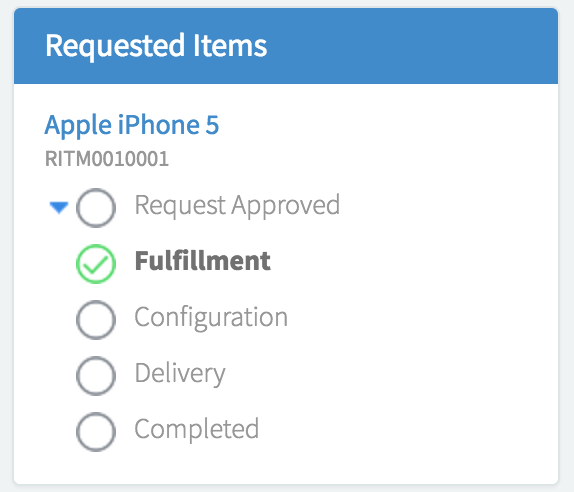

# Requested Items

## Description

Describes at what stage a requested item is currently in.

You can define different workflows for items directly within the Service Catalog module. For more information on Service Catalog workflows, see [Request fulfillment workflows](https://docs.servicenow.com/search?q=Request+fulfillment+workflows).

## Screenshots

---
## Configuration

Widget Option Schema parameters:
> None
---
## ServiceNow® Documentation
[Product Documentation](https://docs.servicenow.com/bundle/istanbul-servicenow-platform/page/build/service-portal/concept/requested-items-widget.html)

---
## Enhance or Expand Features and Functionality

OOB Widgets are `READ ONLY` so you can benefit from future updates. Edit and extend a widget's functionality; you need to clone it first in order to take advantage of existing code.

View production documentation ['Clone a Widget'](https://docs.servicenow.com/bundle/istanbul-servicenow-platform/page/build/service-portal/task/t_CloneAndEditAWidget.html) to learn more.

---
## Platform Dependencies

> Service Catalog

---
## Sample Data and Data Structures

### Service Portal Table
* sp_instance_vlist - fields: Title, Order, Bootstrap color, Display field, Filter, Table, Link to this page, Order direction, Maximum entries, Order by
