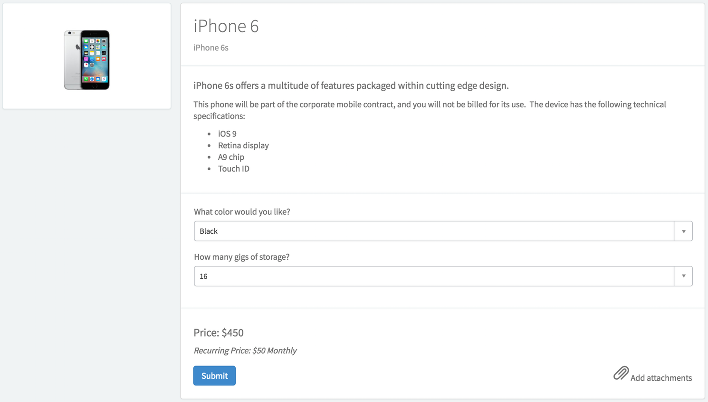

# SC Catalog Item

## Description

Describe catalog items and add options for users to select from.

[Configure catalog items](https://docs.servicenow.com/search?q='Service+catalog+items') using the Service Catalog in the platform UI by navigating to Service Catalog > Catalog Definitions > Maintain items. Because Service Portal is designed with mobile in mind, catalog items must have Availability set to Mobile or Desktop and Mobile and must also be configured for mobile.

Catalog variables determine what information your users are allowed to pick from, for example, color, size, or price. For more information on defining the variables in the catalog item, see [Create a service catalog variable](https://docs.servicenow.com/search?q=%27Create+Service+Catalog+variables%27).

Determine whether users can add this item to the shopping cart by selecting the **Show Add Cart Button** check box in the widget instance options.

## Screenshots

---
## Configuration

Widget Option Schema parameters:

**Show Add Cart Button** - Toggle to display the 'Add Cart' button 
**Custom URL Format** - Define a URL Format for successful order page 
**Successful Order Page** - Page to display for a success order 
**Successful Order Table** - Table used for order 
**Auto Redirect on Successful Order** - Toggle to enable auto-redirection after ordering an item 

---
## ServiceNow® Documentation
[Product Documentation](https://docs.servicenow.com/search?q=SC+Catalog+Item+widget)

---
## Enhance or Expand Features and Functionality

OOB Widgets are `READ ONLY` so you can benefit from future updates. Edit and extend a widget's functionality; you need to clone it first in order to take advantage of existing code.

View production documentation ['Clone a Widget'](https://docs.servicenow.com/bundle/istanbul-servicenow-platform/page/build/service-portal/concept/sc-catalog-item-widget.html) to learn more.

---
## Platform Dependencies

> Service Catalog

