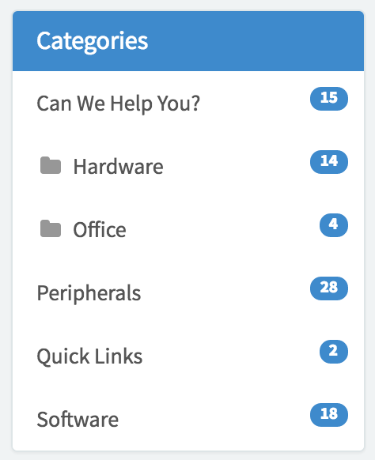

##  SC Categories

## Description

The SC Categories widget displays Service Catalog categories.

The system renders the categories available in this widget from the Categories table in Service Catalog [sc_category].

## Screenshots

---
## Configuration

Widget Option Schema parameters:

**Hide at XS** - Toggle to hidden widget on small displays (mobile)
**Omit badges** - Toggle to not show item badges
**Check canView per item** - Toggle to display all items for a category `(may impact performance for large catalogs)`
**Category Layout** - choices: Flat, Nested
**page**

---
## ServiceNow® Documentation
[Product Documentation](https://docs.servicenow.com/search?q=SC+Categories+widget) 

---
## Enhance or Expand Features and Functionality

OOB Widgets are `READ ONLY` so you can benefit from future updates. Edit and extend a widget's functionality; you need to clone it first in order to take advantage of existing code.

View production documentation ['Clone a Widget'](https://docs.servicenow.com/search?q=Clone+a+Widget) to learn more.

---
## Platform Dependencies
> Service Catalog

### System Tables 
* sc_category

### Angular Providers
* spCategoryListItem