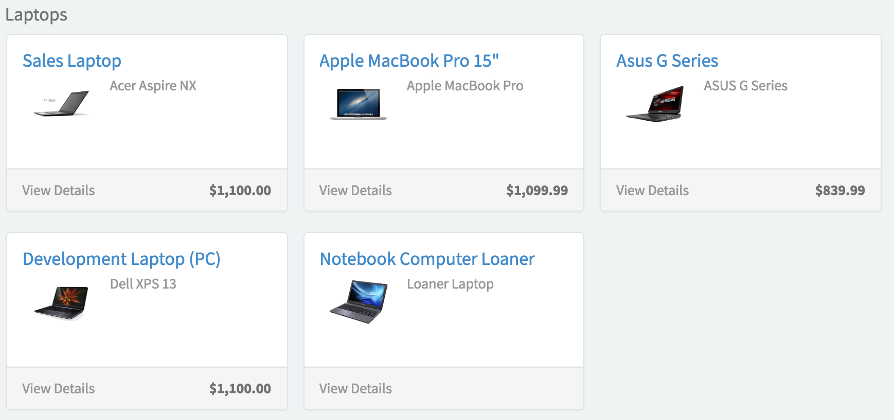

##  SC Category Page

## Description

Lists the catalog items available within a certain category. Categories are determined within the Service Catalog module.

## Screenshots

---
## Configuration

Widget Option Schema parameters:

**Click event name** - Name of event to use on click of an item (if overridden in client script) `Default: $sp.cat_item_list.click`

---
## ServiceNow® Documentation
[Product Documentation](https://docs.servicenow.com/search?q=SC+Category+Page+widget) 

---
## Enhance or Expand Features and Functionality

OOB Widgets are `READ ONLY` so you can benefit from future updates. Edit and extend a widget's functionality; you need to clone it first in order to take advantage of existing code.

View production documentation ['Clone a Widget'](https://docs.servicenow.com/search?q=Clone+a+Widget) to learn more.

---
## Platform Dependencies
> Service Catalog
