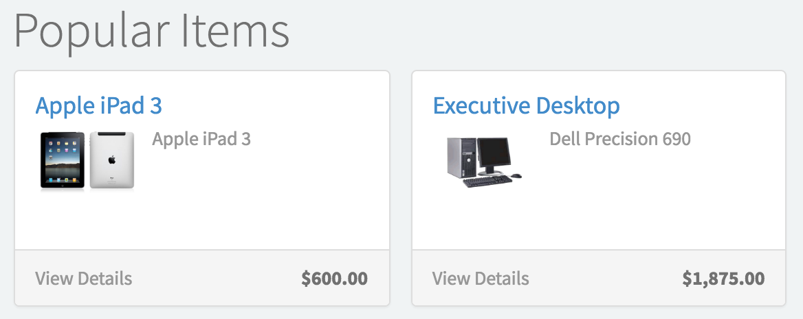

# SC Popular Items

## Description

List of service catalog items that users purchase often.

## Screenshots

---
## Configuration

Widget Option Schema parameters:

**Limit** - Limit the number of items to show. `Default: 9` 
**Include Record Producers** - Toggle to include requests made through Record Producers 

---
## ServiceNow® Documentation
[Product Documentation](https://docs.servicenow.com/bundle/istanbul-servicenow-platform/page/build/service-portal/concept/sc-popular-items.html)

---
## Enhance or Expand Features and Functionality

OOB Widgets are `READ ONLY` so you can benefit from future updates. Edit and extend a widget's functionality; you need to clone it first in order to take advantage of existing code.

View production documentation ['Clone a Widget'](https://docs.servicenow.com/bundle/istanbul-servicenow-platform/page/build/service-portal/task/t_CloneAndEditAWidget.html) to learn more.

---
## Platform Dependencies
> Service Catalog
