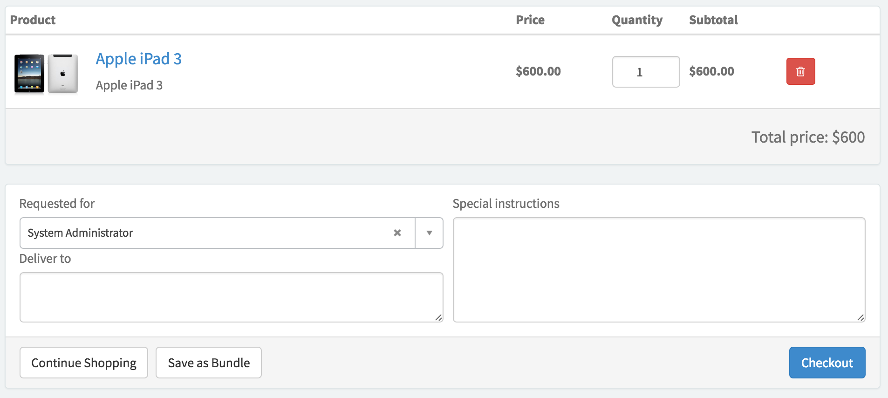

##  SC Shopping Cart

## Description

The shopping cart widget, used in combination with Service Catalog, stores all of your orders in one place.

With the shopping cart widget, you can:

* Control the quantity of items going into the cart.
* Add items to a cart. This information gets stored in the sc_cart table.
* Define who the items are being requested for.
* Save specific items together as a bundle, which can be reloaded at a later time.
* Use the Clear Cart option to remove all the items from your cart.

If you want to add a bundle to your cart from the saved cart, you have the option of replacing all of the existing cart items with the bundle items, or including the bundle items with the cart items.

The shopping cart respects most [Service Catalog properties](https://docs.servicenow.com/search?q=%27Service+Catalog+properties%27).

> NOTE: A Cart Template will need to be defined and configured or an error is produced `Error: Please provide a cart template to render.`

## Screenshots

---
## Configuration

Widget Option Schema parameters:

**Cart Template** - Reference to the Cart Template to be used by the widget.

---
## ServiceNow® Documentation
[Product Documentation](https://docs.servicenow.com/search?q=SC+Shopping+Cart+widget) 

---
## Enhance or Expand Features and Functionality

OOB Widgets are `READ ONLY` so you can benefit from future updates. Edit and extend a widget's functionality; you need to clone it first in order to take advantage of existing code.

View production documentation ['Clone a Widget'](https://docs.servicenow.com/search?q=Clone+a+Widget) to learn more.

---
## Platform Dependencies
> Service Catalog