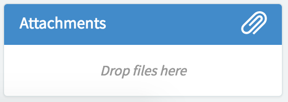

##  Ticket Attachments

## Description

Use the attachment widget to attach items to tickets.

## Screenshots

---
## Configuration

Widget Option Schema parameters:

**Record ID** ID of referenced record  
**Record Table** Table name of referenced record 

---
## ServiceNow® Documentation
[Product Documentation](https://docs.servicenow.com/search?q=Ticket+Attachments) 

---
## Enhance or Expand Features and Functionality

OOB Widgets are `READ ONLY` so you can benefit from future updates. Edit and extend a widget's functionality; you need to clone it first in order to take advantage of existing code.

View production documentation ['Clone a Widget'](https://docs.servicenow.com/search?q=Clone+a+Widget) to learn more.