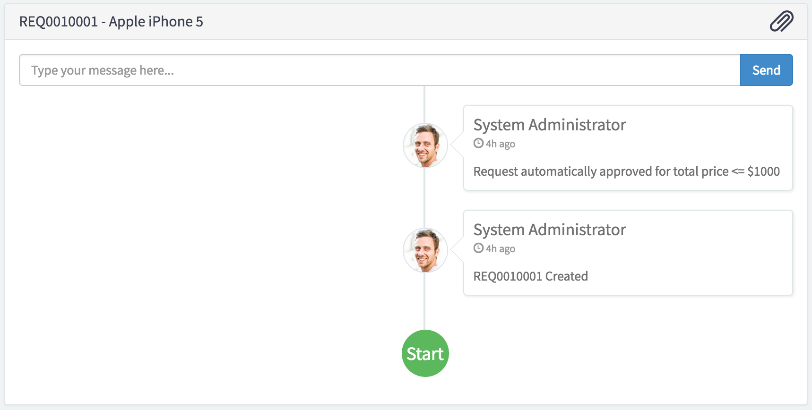

# Ticket Conversations

## Description

Record of ticket items. Users can use this to communicate back and forth with the fulfiller and the receiver.

The Ticket Conversations widget is intended only for tables that extend task.

Limit the number of journal entries that appears in the ticket conversation widget using the glide.service_portal.stream_entry_limit system property. The default number is 100. Change the number by navigating to Service Portal > Properties, and enter the new number in the Maximum number of stream entries displayed in Service Portal field.

## Screenshots

---
## Configuration

Widget Option Schema parameters:
> None

---
## ServiceNow® Documentation
[Product Documentation](https://docs.servicenow.com/bundle/istanbul-servicenow-platform/page/build/service-portal/concept/ticket-conversations-widget.html)

---
## Enhance or Expand Features and Functionality

OOB Widgets are `READ ONLY` so you can benefit from future updates. Edit and extend a widget's functionality; you need to clone it first in order to take advantage of existing code.

View production documentation ['Clone a Widget'](https://docs.servicenow.com/bundle/istanbul-servicenow-platform/page/build/service-portal/task/t_CloneAndEditAWidget.html) to learn more.