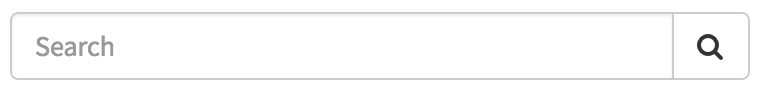

# Typeahead Search

## Description

Predictive search feature that shows words as users type.

## Screenshots

---
## Configuration

Widget Option Schema parameters:

**Title** - Shadow text shown inside the text field 
**Color** - Search button color 
**glyph** - Glyph/Icon to show on the Search button 
**Size** - Input Group size 
**Limit** - Number of typeahead search results returned `Default: 15` 

---
## ServiceNow® Documentation
[Product Documentation](https://docs.servicenow.com/bundle/istanbul-servicenow-platform/page/build/service-portal/concept/typeahead-search-widget.html)

---
## Enhance or Expand Features and Functionality

OOB Widgets are `READ ONLY` so you can benefit from future updates. Edit and extend a widget's functionality; you need to clone it first in order to take advantage of existing code.

View production documentation ['Clone a Widget'](https://docs.servicenow.com/bundle/istanbul-servicenow-platform/page/build/service-portal/task/t_CloneAndEditAWidget.html) to learn more.
