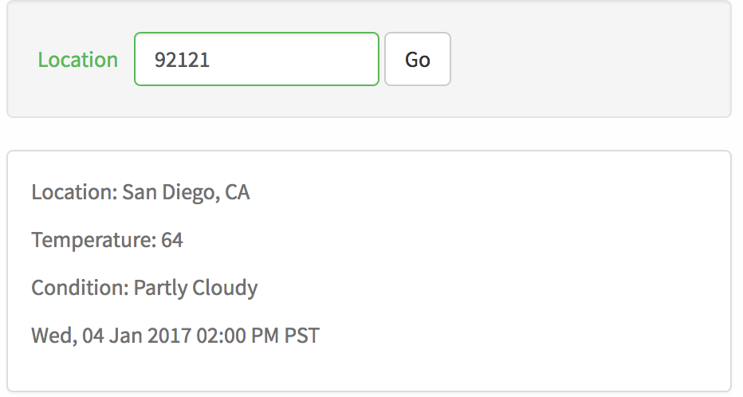

##  Weather

## Description

The Weather widget shows an example of how the server script interprets data from a source outside of the system.

## Screenshots

---
## Configuration

Widget Option Schema parameters:
> None

---
## ServiceNow® Documentation
[Product Documentation](https://docs.servicenow.com/search?q=Weather+widget) 

---
## Enhance or Expand Features and Functionality

OOB Widgets are `READ ONLY` so you can benefit from future updates. Edit and extend a widget's functionality; you need to clone it first in order to take advantage of existing code.

View production documentation ['Clone a Widget'](https://docs.servicenow.com/search?q=Clone+a+Widget) to learn more.

---
## API Dependencies
---
Widget uses [Yahoo's Query Language (YQL)](https://developer.yahoo.com/yql/) API to retrieve data about the provided input.  See more about this API here [Yahoo Weather](https://developer.yahoo.com/weather/)
